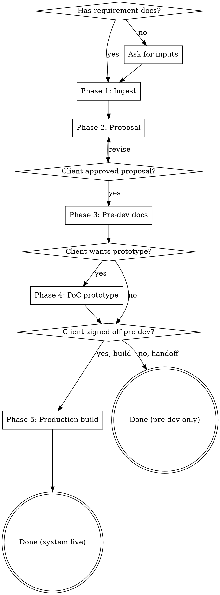

# Codech Project Superpower

## Overview

A 5-phase workflow for going from raw requirements to a complete pre-development deliverable set AND through into production development in one continuous engagement. Captures the Codech approach: bilingual proposals, traceable specs, single-file interactive prototypes, and pixel-faithful production codebases.

**Core principle:** Every artifact serves the next phase. Proposal feeds FSD, FSD feeds SRS, SRS feeds the prototype's data model, prototype validates UX before production code, and the prototype itself becomes the **pixel-diff reference** during Phase 5 development.

**Phase 1–4 = pre-development engagement** (signed off by client before any code is written).
**Phase 5 = production development** (long-running; iterative sub-plans). Only enter Phase 5 after Phase 1–4 are accepted.

## When to Use

**Use this skill when:**
- A "Requirements doc" folder exists in the project (look for `.docx`, `.pdf`, image files, meeting notes)
- User mentions starting a new project, kicking off, scoping, or pre-sales work
- User asks for a project proposal, FSD, SRS, SAD, TDD, or PoC prototype
- User says "let's build a prototype before we commit to the build"
- User says "ready to proceed development", "scaffold the codebase", "start building the system", or asks how to plan the build given an existing pre-dev package (Phase 5 entry)

**Do NOT use this skill for:**
- Bug fixes or feature additions to an existing live system (use targeted skills)
- Internal Codech tooling or build-system changes
- One-off design or documentation requests with no requirements docs

(Phase 5 — production development — is supported when a full Phase 1–4 deliverable set already exists in the project. If the docs are missing or partial, run the missing phases first.)

## Phase Decision Tree



**Phases are gated.** Do not advance past the proposal until the user explicitly approves. The proposal IS the scope contract. Do not enter Phase 5 without an accepted FSD + SAD + TDD + SRS + Prototype.

---

## Phase 1 — Ingest Requirements

### 1.1 Discovery

Locate inputs (in priority order):
1. `./Requirements doc/` folder
2. `./requirements/` or `./docs/requirements/` 
3. Files attached or referenced in user message
4. Ask user to point to inputs

### 1.2 Reading by file type

| File type | Tool | Notes |
|---|---|---|
| `.docx` | Use `docx` skill, or `python` via the unpack script | Set `PYTHONIOENCODING=utf-8` on Windows |
| `.pdf` | Native `Read` tool (handles up to 20 pages; for large PDFs read in ranges) | Returns text + images |
| `.jpg` / `.png` (screenshots, diagrams) | Native `Read` tool | Visual content is described |
| `.xlsx` / `.csv` (data samples) | `Bash` + Python or read via `head` | Note structure, not full contents |
| Meeting notes (any format) | Above | Capture pending items separately |

### 1.3 Extraction output

Produce a structured internal summary (do NOT save unless asked):

```
- Client: <name + sector + locale>
- Stakeholders mentioned: ...
- Existing system / pain points: ...
- Modules / features identified: ...
- Hardware / tech constraints: ...
- Compliance / regulatory: ...
- Pending items (client must clarify): ...
- Cited dates / deadlines: ...
- Primary language detected: ...
```

This summary informs every subsequent phase.

---

## Phase 2 — Proposal Generation

### 2.1 Output sequence

1. **Markdown first** (`Project_Proposal.md`) — single source of truth
2. **Styled HTML** (`Project_Proposal.html`) — for client preview, print-ready
3. **PDF** (`Project_Proposal.pdf`) — final deliverable; export via Chrome headless

If bilingual: create `Project_Proposal_EN.md` / `.html` / `.pdf` alongside.

### 2.2 Section structure

Use the 19-section structure documented in `templates/proposal-structure.md`. Do NOT improvise structure — the sections, numbering, and order are battle-tested.

Mandatory sections include:
- Cover (gradient brand block + meta grid)
- Table of Contents
- Executive Summary (with Value Proposition stat-card grid)
- Project Background & Objectives (As-Is/To-Be diagrams, KPI table)
- Scope of Work (phase pills, in-scope/out-of-scope)
- System Architecture (with inline SVG diagram — see `recipes/architecture-diagram.md`)
- Functional Module Specifications (one subsection per module)
- Integration Services
- Hardware Procurement (if applicable)
- Data Migration Plan
- Security & Compliance (locale-specific: PDPO/GDPR/HIPAA)
- Timeline & Milestones (with Gantt + numbered milestones)
- Deliverables
- Training Plan
- Maintenance & Support (with SLA)
- Risk Management
- Acceptance Criteria
- Assumptions, Exclusions & RACI
- **Pending Items** (cross-reference what client must clarify)
- Appendices (Glossary, References, DB entities, API endpoints, brand palette)

### 2.3 Visual conventions

- Brand colors come from client doc OR detected industry default:
  - Agriculture: green `#2E7D32` + gold `#FFB300`
  - Finance: navy `#0D47A1` + silver `#90A4AE`
  - Healthcare: teal `#00838F` + coral `#FF7043`
  - SaaS/Tech: indigo `#3F51B5` + amber `#FFC107`
  - Override with `--brand.primary` and `--brand.accent` if user specifies
- Architecture diagrams: inline SVG only (never ASCII for the final HTML)
- Use shadcn-style design language for any UI mockups in the appendices

### 2.4 PDF export

Use `recipes/pdf-export.md` — applies these settings every time:
- A4 page size with footer page numbers via `@page` rule
- `--no-pdf-header-footer` to suppress Chrome's default URL/date
- `--virtual-time-budget=15000` to allow Google Fonts to load
- Use a temp Chrome profile per export (`--user-data-dir=...`) to avoid locks

### 2.5 Bilingual handling

If primary language is non-English:
1. Generate the native-language version first
2. Generate the English version with same structure
3. Keep proper nouns (client name, place names) in native script in BOTH versions
4. Code blocks, technical terms, and product names stay in English everywhere
5. System prompts for AI assistants are authored in English even in native-language docs (industry standard)

### 2.6 Approval gate

After generating the proposal, **stop and ask**:
> "Proposal generated. Please review key sections — §4 Scope, §11 Timeline, §18 Pending Items — and let me know if you want to make any changes before we proceed to pre-dev documents."

Wait for explicit approval before Phase 3.

---

## Phase 3 — Pre-Development Documents

Generated in this order, each builds on the prior:

| # | Document | Filename | Owner | Audience |
|---|---|---|---|---|
| 1 | Feature Scope Document | `Feature_Scope_Document.md` | BA | Stakeholders, QA |
| 2 | System Architecture Document | `System_Architecture_Document.md` | Architect | DevOps, Security, Senior Eng |
| 3 | Technical Design Document | `Technical_Design_Document.md` | Lead Engineer | All engineers, DevOps |
| 4 | Software Requirements Specification | `Software_Requirements_Specification.md` | BA + Lead Eng | Everyone (build contract) |

Detailed structure in `templates/pre-dev-docs-structure.md`. Each has:
- Document ID, version, parent doc references
- Module-by-module breakdown
- Feature IDs / REQ IDs / ADRs for traceability
- Sign-off table at bottom

### 3.1 Cross-document traceability

- FSD features (e.g., `F1.5`) → referenced in SRS REQs (e.g., `REQ-POS-FUN-024 → F1.4.1`)
- TDD code structure → references FSD module names
- SRS validation rules → testable in UAT scripts
- Maintain a traceability matrix in SRS §13

### 3.2 ADRs (Architecture Decision Records)

Every significant architectural choice gets an ADR in SAD §13 or a referenced standalone ADR. Format:

```markdown
### ADR-NNN — <decision>
**Context:** ...
**Decision:** ...
**Consequence:** ...
**Status:** Accepted / Proposed / Superseded
```

---

## Phase 4 — PoC Prototype

### 4.1 Scoping (use brainstorming skill)

Invoke `superpowers:brainstorming` to scope the prototype. Offer 3 options:

| Option | Effort | Description |
|---|---|---|
| **A — Critical Daily Loop** | 1 day | 3 key screens covering the operator's most-used workflow |
| **B — Journey Tour** | 1.5–2 days | 3 short user journeys end-to-end across personas |
| **C — Full Module Tour** | 3–4 days | Every module gets at least one screen |

Default recommendation: **Option B**. Recommend C only if client explicitly wants comprehensive review of all screens.

### 4.2 Design system (use ui-ux-pro-max skill)

Invoke `ui-ux-pro-max:ui-ux-pro-max` to confirm:
- Color palette consistent with proposal brand
- Typography (Noto Sans TC + Inter + JetBrains Mono is a good baseline)
- Component design language (shadcn is the default)
- Animation budget (where Framer Motion adds value)

### 4.3 Build the prototype

Single-file HTML at project root: `Prototype.html`. Architecture documented in `templates/poc-prototype-html.md`. Key technical decisions:

- **No build step.** All libraries via CDN with `<script type="importmap">`.
- **React 18** + **Tailwind CSS Play CDN** + **Framer Motion 11** + **Lucide React**.
- **Babel Standalone** required for JSX in browser — without it the page renders blank. See `gotchas.md`.
- **shadcn-style components** reimplemented inline (we can't `npm install` in a single HTML file but the visual language is identical).
- **State-based router** (single `useState` for `view`) — not React Router (overhead for prototype).
- **Sample data** with locale-appropriate names (Hong Kong farm names for an HK ag project, generic names for SaaS, etc.).
- **AI chatbot widget** if the proposal includes AI — scripted streaming conversation, not real LLM call.

### 4.4 Gotchas reference

**Always** review `gotchas.md` BEFORE building. Common silent-failure traps:
- JSX in `<script type="module">` renders blank without Babel
- Cover pages split across PDF pages without flex column + `margin-top: auto`
- `:first-of-type` matches every section, not the first
- Right-aligned flex clusters need `ml-auto`, not `flex-1` on the sibling
- Stat cards split mid-height without `page-break-inside: avoid`

---

## Phase 5 — Production Development

Phase 5 is **long-running** (weeks to months). It is NOT one deliverable; it is a series of small, gated sub-plans authored and executed via `superpowers:writing-plans` + `superpowers:executing-plans` (or `superpowers:subagent-driven-development`). The pre-dev docs from Phases 1–4 are the **sources of truth** — never invent requirements that aren't in the FSD/SAD/TDD/SRS.

### 5.1 Sources of truth

| Doc | Authority for |
|---|---|
| FSD | Feature scope, module list, acceptance criteria |
| SAD | System topology, ADRs, deployment shape, infra choices |
| TDD | Module code structure, data model, key algorithms |
| SRS | REQ IDs, validation rules, traceability matrix |
| `Prototype.html` | **Pixel-level visual contract** — the UI MUST match it |

When in doubt, the **SRS REQ IDs win** (they cite back to FSD features and are testable). When a sub-plan would deviate from any source-of-truth doc, document the deviation in the Master Plan §6.2 (deviations) — never silently drift.

### 5.2 Master Implementation Plan

Phase 5 starts with a single **Master Implementation Plan** at `docs/Implementation_Master_Plan.md`. This is the index and contract for all sub-plans. Structure documented in `templates/master-plan-structure.md`. Mandatory sections:

1. Purpose
2. Sources of truth (links to FSD/SAD/TDD/SRS/Prototype)
3. Repo structure (monorepo layout: `apps/{api,web}` + `packages/{shared,ui}`)
4. Traceability map (workstream → FSD features → SRS REQs)
5. Workstream sequence + approval gates
6. Sub-plan index
  - §6.1 Delivery breakdown (what each sub-plan actually shipped)
  - §6.2 Deviations from prototype / pre-dev docs (with rationale)
7. Pixel-diff discipline (Playwright + threshold + cross-platform notes)
8. Stack decisions (locked) — bcrypt 4.0.1, PG 5433 in dev, ubuntu-24.04 CI, etc.
9. Risk register
10. Definition of Done (per workstream)
11. Maintenance & roadmap

### 5.3 Sub-plan iteration loop

Each workstream is a **separate** plan file under `docs/superpowers/plans/YYYY-MM-DD-<workstream>.md`. Recommended sequence:

| # | Sub-plan | Output | Gate before next |
|---|---|---|---|
| 01 | Foundation / monorepo scaffold | uv + pnpm workspace, lint/test/CI green, pixel-diff harness | Local dev up; first baseline image accepted |
| 02 | Auth / RBAC / DB baseline | Login flow + JWT + 2FA + Alembic migrations + audit log | Login screen matches prototype within threshold |
| 03 | First domain module (master data / admin) | First real CRUD + shared `<MasterTable>` abstraction | All admin master screens match prototype |
| 04+ | One sub-plan per remaining FSD module | Module-by-module CRUD + reports + integrations | Each module signed off |
| N | Hardening | Performance, observability, e2e smoke | Pre-production checklist |
| N+1 | UAT + Production cutover | Migration scripts, runbook | Client UAT sign-off |

**Each sub-plan MUST:**
- Cite FSD features + SRS REQs it implements
- List every file it creates/modifies (no "and similar")
- Be TDD (failing test → impl → passing test → commit)
- Have a verification step that runs the actual test command
- Update Master Plan §6.1 + §6.2 when complete

### 5.4 Foundation sub-plan — what's non-obvious

The first sub-plan establishes guardrails that every later sub-plan depends on. **Get these right or pay forever:**

- **Pixel-diff harness from day one** — see `recipes/pixel-diff-harness.md`. The prototype is the visual contract; without an automated check, drift is invisible until the client demos it.
- **Cross-platform baselines** — generate baselines on BOTH the developer's OS (e.g. Windows) and the CI runner's OS (Linux). Font rendering differs enough to fail diff thresholds. Use the official Playwright Docker image (`mcr.microsoft.com/playwright:vX.Y.Z-noble`) to generate Linux baselines from a Windows host.
- **Pin every CI dependency loudly** — Node version in `.nvmrc` + `package.json#engines` + GitHub Actions setup. pnpm 11 needs Node 22.13+ for `node:sqlite`. Mismatch = silent CI red.
- **Match CI runner to baseline platform** — if Linux baselines are `noble`, use `ubuntu-24.04` runners, not `ubuntu-22.04`. Font packages differ.
- **Field-level encryption from the start** — if any column needs encryption, wire it in now (Python reference impl in `recipes/field-level-encryption-python.md`; the AES-GCM-for-random + AES-SIV-for-deterministic split is stack-agnostic). Retrofitting onto existing rows after data lands is painful.
- **Audit table before any mutation route** — every POST/PATCH/DELETE writes an audit event in the same transaction. Add it once, enforce in code review.

### 5.5 Auth sub-plan — universal patterns

These patterns are **stack-agnostic** — apply them no matter what language/framework you choose:

- **Two-token JWT pattern.** Access token (short-lived, ~15min) + refresh token. The refresh token lives in an `HttpOnly` cookie with `SameSite=Lax` and `Path=/auth/refresh` — anything looser is a CSRF risk; anything stricter breaks cross-tab refresh.
- **2FA stage-1 token must use a different audience claim** than the access token, or the client can skip the OTP step.
- **JWT base64url payloads need padding before any base64 decoder** (browser `atob`, etc.). Without it, expiry parsing silently fails on a subset of tokens.
- **Lockout after N (default 5) failed attempts**, recorded in the **audit table** — never in memory, never in a cache. Survives restarts and is admin-visible.
- **Password hashing** uses a memory-hard or well-audited algorithm (bcrypt / argon2 / scrypt). Pin the hashing library version explicitly — major-version bumps break compatibility silently more often than you'd think.
- **Audit every auth event** in the same transaction as the state change: successful login, failed login, lockout, password reset, 2FA enable/disable.

**Reference implementation:** the gotchas list includes specific traps we hit on the CGG ERP stack (Python + passlib + bcrypt). The relevant entries are tagged "Python/FastAPI stack" in `gotchas.md` — read them only if your stack matches. For Node, Go, Rails, etc. the universal patterns above still hold; the specific library pins do not.

### 5.6 Module sub-plan template — universal patterns

For every functional module beyond auth, the sub-plan must cover these **four pattern axes** regardless of stack:

1. **Backend** — one folder per module with a clear file-per-responsibility split
   - **Pattern:** `<module>/{data-model, request/response shapes, business logic, transport adapter}` — names vary by stack but the four roles do not. Transport (HTTP router) only does validation + dependency wiring + business-logic invocation.
   - **Shared CRUD helper** for list/get-or-404/write-audit-event — define once, call everywhere; one fewer place to forget the audit write.
   - **Typed error hierarchy** with HTTP status + machine-readable code. Never throw the framework's HTTP exception from deep in business logic — one handler at the transport edge translates the typed error to a response.
   - **Audit write before transaction commit**, in the same transaction as the change. If audit is a separate transaction, audit and entity can drift.
2. **Frontend** — one hook file per entity, screens composed from shared atoms
   - **Pattern:** CRUD-hook factory parameterised by row/create/update types, so every entity gets `list/get/create/update/delete` in one line.
   - **Shared table + modal + field abstractions** so each new screen is config (columns + form fields) rather than handwritten markup.
   - **Server-state library** (e.g. TanStack Query, SWR, RTK Query) for cache/optimistic updates; **client-state library** (Zustand, Pinia, Redux) for auth/UI state. Don't conflate them.
   - **Pixel-diff spec for every new screen** against the prototype subview — same threshold and cross-platform baseline discipline as the foundation sub-plan (§5.9).
3. **Tests**
   - **Backend:** integration-style — real DB, no mocking the DB. Mock only third-party external services.
   - **Frontend:** unit tests for hooks/logic; visual tests for screens; smoke (real browser) for at least one happy path per module.
4. **Audit + RBAC** — every mutation route is permissioned, every mutation writes an audit event. Enforce in code review.

**Reference implementations:**
- FastAPI + SQLModel: see `recipes/backend-crud-module-fastapi.md`
- (Add `recipes/backend-crud-module-<your-stack>.md` for new stacks — same pattern axes, different code.)

**Applying the pattern to other stacks:**

| Stack | Module layout | Audit pattern | Error pattern |
|---|---|---|---|
| FastAPI + SQLModel | `modules/<name>/{models,schemas,service,router}.py` | `write_audit_event(db, ...)` before `db.commit()` | `AppError` + one `@app.exception_handler` |
| NestJS + Prisma | `<name>/{<name>.entity.ts, <name>.dto.ts, <name>.service.ts, <name>.controller.ts}` | Prisma `$transaction` containing the audit write + the mutation | Custom `HttpException` subclass + filter |
| Rails + ActiveRecord | `app/models/<name>.rb`, `app/services/<name>/`, `app/controllers/<name>_controller.rb` | `ActiveRecord::Base.transaction { ...; AuditEvent.create!(...) }` | `ApplicationError` + `rescue_from` |
| Go + sqlc | `internal/<name>/{store.go, service.go, handler.go}` + `<name>.sql` | Single `Tx` value passed through service + audit insert | Typed sentinel errors + middleware translator |

The discipline (file-per-responsibility, audit-in-same-tx, typed errors, shared CRUD helper, frontend factory + shared atoms) is the contract. The filenames and library names are interchangeable.

### 5.7 CLAUDE.md in the codebase

Phase 5 codebase MUST have a `CLAUDE.md` at the repo root (or `apps/web/CLAUDE.md` + `apps/api/CLAUDE.md` for monorepos). Contents:
- Orientation (1 paragraph: what this codebase is, which docs to read first)
- Commands cheat sheet (dev, lint, test, migrate, baseline-regen)
- Locked architectural choices (cite ADR-NNN, do not relitigate)
- Code conventions (backend module layout, frontend hooks/store pattern, visual-diff harness)
- Gotchas table (the same ones from this skill's `gotchas.md` that apply to this codebase)
- Git + GitHub workflow
- "What to do for a new sub-plan" checklist

This file is consumed by future Claude sessions — it prevents re-discovering the same traps each session.

### 5.8 Cross-session memory

Phase 5 spans many sessions. Maintain auto-memory entries:
- `project_<name>_decisions.md` — locked architectural choices (ADRs cited)
- `project_<name>_status.md` — current phase, pending items, last sign-off
- `project_<name>_phaseN_progress.md` — when starting a new phase, snapshot the prior one before it goes stale

Update memory whenever: client sign-off occurs, a sub-plan completes, a deviation from pre-dev docs is accepted, or a new gotcha is discovered.

### 5.9 Pixel-diff discipline

- Default threshold: `0.001` (0.1% of pixels may differ). Tighter is brittle; looser hides regressions.
- Baselines committed in **two folders**: `chromium-win32/` and `chromium-linux/`. CI uses the Linux set.
- When a real UI change ships, regenerate baselines on BOTH platforms and commit them in the same PR as the code change. PRs that change UI without baseline updates fail CI.
- Use `getByRole("button", { name, exact: true })` not `text=` — substring matches cause flake.
- `page.addInitScript()` closures don't capture outer scope after serialization; pass data via the second-arg payload.

### 5.10 Phase 5 approval gates

| Gate | Action |
|---|---|
| Before first sub-plan | Master Plan reviewed; sources of truth confirmed; stack locked |
| Each sub-plan complete | Run `superpowers:finishing-a-development-branch`; tests green; pixel-diff clean; update Master Plan §6.1/§6.2 |
| Before module sub-plans | Foundation + Auth must be merged and stable |
| Before UAT cutover | All FSD modules done; full SRS traceability matrix complete; runbook written |

---

## Cross-Cutting Concerns

### Locale awareness

| Locale signal | Action |
|---|---|
| Trad Chinese in docs | Proposal in 繁中 + English bilingual; receipts bilingual |
| Simp Chinese in docs | Proposal in 简中; offer Trad Chinese conversion |
| Japanese in docs | Proposal in 日本語; English secondary |
| Mixed/English | Single English proposal; ask if other languages needed |

Always set HTML `lang` attribute correctly. Always pre-connect to Google Fonts for CJK if used.

### Industry awareness

| Industry signal | Compliance section | Recommended palette | Typical modules |
|---|---|---|---|
| Agriculture / cooperative | PDPO (HK), GDPR (EU) | green + gold | POS, inventory, certification, farm mgmt, chatbot |
| Finance / fintech | PCI-DSS, MAS, HKMA | navy + silver | KYC, transactions, reporting, compliance |
| Healthcare | HIPAA, PDPO health | teal + coral | EMR, scheduling, billing, lab |
| E-commerce / retail | PCI-DSS, GDPR | varies | catalog, cart, fulfillment, returns |
| SaaS / B2B tools | SOC 2, GDPR | indigo + amber | workspaces, integrations, billing, admin |

### Brand override

If user provides a `brand.json` or specifies palette explicitly, use that. Otherwise default to industry palette.

---

## Required Sub-Skills

This skill orchestrates the following — invoke when needed:

| Sub-skill | Use for | Phase |
|---|---|---|
| `docx` | Reading and creating Word documents | 1, 2 (output) |
| `superpowers:brainstorming` | Scoping the prototype options + Phase 5 sub-plan scoping | 4, 5 |
| `ui-ux-pro-max:ui-ux-pro-max` | Design system confirmation | 4 |
| `superpowers:writing-plans` | Authoring the Master Plan + every Phase 5 sub-plan | 5 |
| `superpowers:executing-plans` | Inline execution of sub-plans (checkpoint-based) | 5 |
| `superpowers:subagent-driven-development` | Fresh-subagent-per-task execution of sub-plans (preferred for long plans) | 5 |
| `superpowers:finishing-a-development-branch` | Completing each sub-plan (test-verify → merge/PR → cleanup) | 5 |

---

## Output File Conventions

At project root (do not nest in subfolders unless user requests):

```
<project root>/
├── Requirements doc/                     # Input (already exists)
├── Project_Proposal.md
├── Project_Proposal.html
├── Project_Proposal.pdf
├── Project_Proposal_EN.md                # If bilingual
├── Project_Proposal_EN.html
├── Project_Proposal_EN.pdf
├── Feature_Scope_Document.md
├── System_Architecture_Document.md
├── Technical_Design_Document.md
├── Software_Requirements_Specification.md
├── Prototype.html
└── docs/
    └── superpowers/specs/
        └── YYYY-MM-DD-poc-prototype-design.md
```

### Phase 5 codebase layout (monorepo)

When Phase 5 begins, the production codebase typically lives in a sibling folder (e.g. `<project>/<slug>-erp/`) and the Phase 1–4 docs are moved into `<slug>-erp/docs/` so they ship with the repo. Recommended layout:

```
<project>-<slug>/
├── CLAUDE.md                              # Phase 5 orientation
├── README.md
├── docs/                                  # Phase 1–4 docs + master plan
│   ├── Implementation_Master_Plan.md
│   ├── Feature_Scope_Document.md
│   ├── System_Architecture_Document.md
│   ├── Technical_Design_Document.md
│   ├── Software_Requirements_Specification.md
│   ├── Prototype.html
│   └── superpowers/plans/
│       ├── 2026-MM-DD-foundation.md
│       ├── 2026-MM-DD-auth-rbac-db.md
│       └── 2026-MM-DD-<module>.md
├── apps/
│   ├── api/                               # FastAPI/NestJS/etc.
│   └── web/                               # React + Vite
├── packages/
│   ├── shared/
│   └── ui/
├── tests/visual/                          # Pixel-diff specs + baselines
├── docker-compose.dev.yml
└── .github/workflows/ci.yml
```

---

## Templates & Recipes

| File | Purpose |
|---|---|
| `gotchas.md` | Battle-tested pitfalls — READ BEFORE EVERY PHASE |
| `templates/proposal-structure.md` | 19-section proposal structure + CSS conventions |
| `templates/pre-dev-docs-structure.md` | FSD/SAD/TDD/SRS templates with ID schemes |
| `templates/poc-prototype-html.md` | Single-file React prototype scaffold |
| `templates/master-plan-structure.md` | Phase 5 Master Implementation Plan structure (11 mandatory sections) |
| `recipes/pdf-export.md` | Chrome headless export commands |
| `recipes/architecture-diagram.md` | Inline SVG diagram conventions |
| `recipes/pixel-diff-harness.md` | Phase 5 — cross-platform Playwright visual regression setup (stack-agnostic; assumes Playwright) |
| `recipes/backend-crud-module-fastapi.md` | Phase 5 — **reference impl** of the CRUD pattern for FastAPI + SQLModel + Alembic. See SKILL §5.6 for the universal pattern. |
| `recipes/field-level-encryption-python.md` | Phase 5 — **reference impl** of AES-256-GCM + AES-256-SIV via SQLAlchemy `TypeDecorator`. For other stacks, the algorithm choice is the same; the binding layer differs. |

---

## Quick Reference

### Trigger phrases and what they map to

| User says | Phase to enter |
|---|---|
| "scope this project" / "what should we build" | Phase 1 + 2 |
| "generate a project proposal from these docs" | Phase 1 + 2 |
| "convert the proposal to HTML and PDF" | Phase 2 (output stage) |
| "draft the FSD" / "create the SRS" | Phase 3 (specific doc) |
| "what documents should we prepare before development" | Phase 3 (all docs) |
| "build a PoC prototype" / "design the UI" | Phase 4 |
| "I want to see the screens" | Phase 4 |
| "ready to proceed development" / "how should we plan the build" | Phase 5 (Master Plan) |
| "scaffold the monorepo" / "set up the codebase" | Phase 5 sub-plan 01 (foundation) |
| "add auth" / "wire up login" (with pre-dev docs present) | Phase 5 sub-plan 02 (auth) |
| "build the X module" (with pre-dev docs present) | Phase 5 module sub-plan |

### Approval gates (DO NOT skip)

1. After requirements summary → confirm understanding before drafting proposal
2. After proposal → wait for explicit "approved" before pre-dev docs
3. After PoC scope options → wait for client to pick A/B/C
4. Always present visual outputs (HTML, PDF) and ask for feedback before treating them as final
5. **Phase 5 entry** → confirm FSD + SAD + TDD + SRS + Prototype are all accepted before scaffolding any code
6. **Phase 5 Master Plan** → user reviews + approves Master Plan before any sub-plan begins
7. **Each Phase 5 sub-plan** → use `superpowers:finishing-a-development-branch` (tests green + pixel-diff clean + Master Plan §6.1/§6.2 updated) before starting the next sub-plan

### Common file size sanity check

| Output | Typical size |
|---|---|
| `Project_Proposal.md` | ~1,200–2,000 lines |
| `Project_Proposal.html` | ~1,500–3,000 lines (HTML overhead) |
| `Project_Proposal.pdf` | 1.5–3 MB, 40–50 pages |
| `Feature_Scope_Document.md` | ~700–1,000 lines |
| `Technical_Design_Document.md` | ~1,200–1,800 lines |
| `Software_Requirements_Specification.md` | ~1,000–1,500 lines |
| `Prototype.html` | ~2,000–3,500 lines (single file with all components) |
| Phase 5 `docs/Implementation_Master_Plan.md` | ~400–800 lines |
| Phase 5 sub-plan (foundation) | ~600–1,200 lines (20–25 tasks) |
| Phase 5 sub-plan (auth) | ~400–800 lines (12–18 tasks) |
| Phase 5 sub-plan (single module) | ~300–600 lines (10–15 tasks) |
| Phase 5 codebase `CLAUDE.md` | ~100–180 lines |

If any output is dramatically smaller, you may have cut corners. Review against templates.

---

## Common Mistakes

| Mistake | Fix |
|---|---|
| Skipping the requirements summary, jumping straight to proposal | Always extract structured summary first; tells you what to include in §18 Pending Items |
| Treating the proposal as a sales doc — light on detail | Proposal IS the scope contract. Pending Items must be explicit |
| Writing FSD without the SRS REQ IDs in mind | Plan ID schemes upfront so traceability works |
| Building prototype without scoping first | Always Phase 4.1 (brainstorming) before 4.3 |
| Using ASCII diagrams in final HTML proposal | Inline SVG only for final deliverables |
| Forgetting Babel Standalone in prototype | Page renders blank with no error in console (because the script never parses) |
| Not pre-connecting to Google Fonts in CJK docs | First-paint flash with system fonts |
| Re-running Chrome export with same profile | File lock error; always use temp profile |

---

## What Makes This Skill Different

- **Captures actual hard-won lessons**, not theoretical best practices
- **Single-file HTML for proposals AND prototypes** — clients can open in any browser, no infra
- **PDF as first-class citizen** — Chrome headless reliably preserves CSS, SVG, gradients
- **Traceable specs** — every feature gets an ID, every REQ traces back to a feature
- **Locale + industry adaptive** — defaults pick sensible palette/compliance without asking
- **End-to-end coverage** — pre-development (Phases 1–4) AND production development (Phase 5) under one roof, with the prototype acting as the pixel-diff contract between them

This is the Codech approach packaged for reuse. Every future engagement starts at 70% complete and stays coherent through production cutover.
