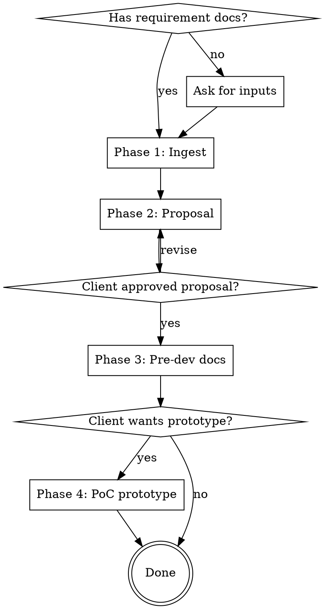

# Codech Project Superpower

## Overview

A 4-phase workflow for going from raw requirements to a complete pre-development deliverable set in one focused engagement. Captures the Codech approach: bilingual proposals, traceable specs, single-file interactive prototypes.

**Core principle:** Every artifact serves the next phase. Proposal feeds FSD, FSD feeds SRS, SRS feeds the prototype's data model, prototype validates UX before any production code is written.

## When to Use

**Use this skill when:**
- A "Requirements doc" folder exists in the project (look for `.docx`, `.pdf`, image files, meeting notes)
- User mentions starting a new project, kicking off, scoping, or pre-sales work
- User asks for a project proposal, FSD, SRS, SAD, TDD, or PoC prototype
- User says "let's build a prototype before we commit to the build"

**Do NOT use this skill for:**
- Bug fixes or feature additions to an existing live system (use targeted skills)
- Production code generation (this skill stops at prototypes)
- Internal Codech tooling or build-system changes
- One-off design or documentation requests with no requirements docs

## Phase Decision Tree



**Phases are gated.** Do not advance past the proposal until the user explicitly approves. The proposal IS the scope contract.

---

## Phase 1 — Ingest Requirements

### 1.1 Discovery

Locate inputs (in priority order):
1. `./Requirements doc/` folder
2. `./requirements/` or `./docs/requirements/` 
3. Files attached or referenced in user message
4. Ask user to point to inputs

### 1.2 Reading by file type

| File type | Tool | Notes |
|---|---|---|
| `.docx` | Use `docx` skill, or `python` via the unpack script | Set `PYTHONIOENCODING=utf-8` on Windows |
| `.pdf` | Native `Read` tool (handles up to 20 pages; for large PDFs read in ranges) | Returns text + images |
| `.jpg` / `.png` (screenshots, diagrams) | Native `Read` tool | Visual content is described |
| `.xlsx` / `.csv` (data samples) | `Bash` + Python or read via `head` | Note structure, not full contents |
| Meeting notes (any format) | Above | Capture pending items separately |

### 1.3 Extraction output

Produce a structured internal summary (do NOT save unless asked):

```
- Client: <name + sector + locale>
- Stakeholders mentioned: ...
- Existing system / pain points: ...
- Modules / features identified: ...
- Hardware / tech constraints: ...
- Compliance / regulatory: ...
- Pending items (client must clarify): ...
- Cited dates / deadlines: ...
- Primary language detected: ...
```

This summary informs every subsequent phase.

---

## Phase 2 — Proposal Generation

### 2.1 Output sequence

1. **Markdown first** (`Project_Proposal.md`) — single source of truth
2. **Styled HTML** (`Project_Proposal.html`) — for client preview, print-ready
3. **PDF** (`Project_Proposal.pdf`) — final deliverable; export via Chrome headless

If bilingual: create `Project_Proposal_EN.md` / `.html` / `.pdf` alongside.

### 2.2 Section structure

Use the 19-section structure documented in `templates/proposal-structure.md`. Do NOT improvise structure — the sections, numbering, and order are battle-tested.

Mandatory sections include:
- Cover (gradient brand block + meta grid)
- Table of Contents
- Executive Summary (with Value Proposition stat-card grid)
- Project Background & Objectives (As-Is/To-Be diagrams, KPI table)
- Scope of Work (phase pills, in-scope/out-of-scope)
- System Architecture (with inline SVG diagram — see `recipes/architecture-diagram.md`)
- Functional Module Specifications (one subsection per module)
- Integration Services
- Hardware Procurement (if applicable)
- Data Migration Plan
- Security & Compliance (locale-specific: PDPO/GDPR/HIPAA)
- Timeline & Milestones (with Gantt + numbered milestones)
- Deliverables
- Training Plan
- Maintenance & Support (with SLA)
- Risk Management
- Acceptance Criteria
- Assumptions, Exclusions & RACI
- **Pending Items** (cross-reference what client must clarify)
- Appendices (Glossary, References, DB entities, API endpoints, brand palette)

### 2.3 Visual conventions

- Brand colors come from client doc OR detected industry default:
  - Agriculture: green `#2E7D32` + gold `#FFB300`
  - Finance: navy `#0D47A1` + silver `#90A4AE`
  - Healthcare: teal `#00838F` + coral `#FF7043`
  - SaaS/Tech: indigo `#3F51B5` + amber `#FFC107`
  - Override with `--brand.primary` and `--brand.accent` if user specifies
- Architecture diagrams: inline SVG only (never ASCII for the final HTML)
- Use shadcn-style design language for any UI mockups in the appendices

### 2.4 PDF export

Use `recipes/pdf-export.md` — applies these settings every time:
- A4 page size with footer page numbers via `@page` rule
- `--no-pdf-header-footer` to suppress Chrome's default URL/date
- `--virtual-time-budget=15000` to allow Google Fonts to load
- Use a temp Chrome profile per export (`--user-data-dir=...`) to avoid locks

### 2.5 Bilingual handling

If primary language is non-English:
1. Generate the native-language version first
2. Generate the English version with same structure
3. Keep proper nouns (client name, place names) in native script in BOTH versions
4. Code blocks, technical terms, and product names stay in English everywhere
5. System prompts for AI assistants are authored in English even in native-language docs (industry standard)

### 2.6 Approval gate

After generating the proposal, **stop and ask**:
> "Proposal generated. Please review key sections — §4 Scope, §11 Timeline, §18 Pending Items — and let me know if you want to make any changes before we proceed to pre-dev documents."

Wait for explicit approval before Phase 3.

---

## Phase 3 — Pre-Development Documents

Generated in this order, each builds on the prior:

| # | Document | Filename | Owner | Audience |
|---|---|---|---|---|
| 1 | Feature Scope Document | `Feature_Scope_Document.md` | BA | Stakeholders, QA |
| 2 | System Architecture Document | `System_Architecture_Document.md` | Architect | DevOps, Security, Senior Eng |
| 3 | Technical Design Document | `Technical_Design_Document.md` | Lead Engineer | All engineers, DevOps |
| 4 | Software Requirements Specification | `Software_Requirements_Specification.md` | BA + Lead Eng | Everyone (build contract) |

Detailed structure in `templates/pre-dev-docs-structure.md`. Each has:
- Document ID, version, parent doc references
- Module-by-module breakdown
- Feature IDs / REQ IDs / ADRs for traceability
- Sign-off table at bottom

### 3.1 Cross-document traceability

- FSD features (e.g., `F1.5`) → referenced in SRS REQs (e.g., `REQ-POS-FUN-024 → F1.4.1`)
- TDD code structure → references FSD module names
- SRS validation rules → testable in UAT scripts
- Maintain a traceability matrix in SRS §13

### 3.2 ADRs (Architecture Decision Records)

Every significant architectural choice gets an ADR in SAD §13 or a referenced standalone ADR. Format:

```markdown
### ADR-NNN — <decision>
**Context:** ...
**Decision:** ...
**Consequence:** ...
**Status:** Accepted / Proposed / Superseded
```

---

## Phase 4 — PoC Prototype

### 4.1 Scoping (use brainstorming skill)

Invoke `superpowers:brainstorming` to scope the prototype. Offer 3 options:

| Option | Effort | Description |
|---|---|---|
| **A — Critical Daily Loop** | 1 day | 3 key screens covering the operator's most-used workflow |
| **B — Journey Tour** | 1.5–2 days | 3 short user journeys end-to-end across personas |
| **C — Full Module Tour** | 3–4 days | Every module gets at least one screen |

Default recommendation: **Option B**. Recommend C only if client explicitly wants comprehensive review of all screens.

### 4.2 Design system (use ui-ux-pro-max skill)

Invoke `ui-ux-pro-max:ui-ux-pro-max` to confirm:
- Color palette consistent with proposal brand
- Typography (Noto Sans TC + Inter + JetBrains Mono is a good baseline)
- Component design language (shadcn is the default)
- Animation budget (where Framer Motion adds value)

### 4.3 Build the prototype

Single-file HTML at project root: `Prototype.html`. Architecture documented in `templates/poc-prototype-html.md`. Key technical decisions:

- **No build step.** All libraries via CDN with `<script type="importmap">`.
- **React 18** + **Tailwind CSS Play CDN** + **Framer Motion 11** + **Lucide React**.
- **Babel Standalone** required for JSX in browser — without it the page renders blank. See `gotchas.md`.
- **shadcn-style components** reimplemented inline (we can't `npm install` in a single HTML file but the visual language is identical).
- **State-based router** (single `useState` for `view`) — not React Router (overhead for prototype).
- **Sample data** with locale-appropriate names (Hong Kong farm names for an HK ag project, generic names for SaaS, etc.).
- **AI chatbot widget** if the proposal includes AI — scripted streaming conversation, not real LLM call.

### 4.4 Gotchas reference

**Always** review `gotchas.md` BEFORE building. Common silent-failure traps:
- JSX in `<script type="module">` renders blank without Babel
- Cover pages split across PDF pages without flex column + `margin-top: auto`
- `:first-of-type` matches every section, not the first
- Right-aligned flex clusters need `ml-auto`, not `flex-1` on the sibling
- Stat cards split mid-height without `page-break-inside: avoid`

---

## Cross-Cutting Concerns

### Locale awareness

| Locale signal | Action |
|---|---|
| Trad Chinese in docs | Proposal in 繁中 + English bilingual; receipts bilingual |
| Simp Chinese in docs | Proposal in 简中; offer Trad Chinese conversion |
| Japanese in docs | Proposal in 日本語; English secondary |
| Mixed/English | Single English proposal; ask if other languages needed |

Always set HTML `lang` attribute correctly. Always pre-connect to Google Fonts for CJK if used.

### Industry awareness

| Industry signal | Compliance section | Recommended palette | Typical modules |
|---|---|---|---|
| Agriculture / cooperative | PDPO (HK), GDPR (EU) | green + gold | POS, inventory, certification, farm mgmt, chatbot |
| Finance / fintech | PCI-DSS, MAS, HKMA | navy + silver | KYC, transactions, reporting, compliance |
| Healthcare | HIPAA, PDPO health | teal + coral | EMR, scheduling, billing, lab |
| E-commerce / retail | PCI-DSS, GDPR | varies | catalog, cart, fulfillment, returns |
| SaaS / B2B tools | SOC 2, GDPR | indigo + amber | workspaces, integrations, billing, admin |

### Brand override

If user provides a `brand.json` or specifies palette explicitly, use that. Otherwise default to industry palette.

---

## Required Sub-Skills

This skill orchestrates the following — invoke when needed:

| Sub-skill | Use for | Phase |
|---|---|---|
| `docx` | Reading and creating Word documents | 1, 2 (output) |
| `superpowers:brainstorming` | Scoping the prototype options | 4 |
| `ui-ux-pro-max:ui-ux-pro-max` | Design system confirmation | 4 |
| `superpowers:writing-plans` | If client requests an implementation plan after acceptance | post |

---

## Output File Conventions

At project root (do not nest in subfolders unless user requests):

```
<project root>/
├── Requirements doc/                     # Input (already exists)
├── Project_Proposal.md
├── Project_Proposal.html
├── Project_Proposal.pdf
├── Project_Proposal_EN.md                # If bilingual
├── Project_Proposal_EN.html
├── Project_Proposal_EN.pdf
├── Feature_Scope_Document.md
├── System_Architecture_Document.md
├── Technical_Design_Document.md
├── Software_Requirements_Specification.md
├── Prototype.html
└── docs/
    └── superpowers/specs/
        └── YYYY-MM-DD-poc-prototype-design.md
```

---

## Templates & Recipes

| File | Purpose |
|---|---|
| `gotchas.md` | Battle-tested pitfalls — READ BEFORE EVERY PHASE |
| `templates/proposal-structure.md` | 19-section proposal structure + CSS conventions |
| `templates/pre-dev-docs-structure.md` | FSD/SAD/TDD/SRS templates with ID schemes |
| `templates/poc-prototype-html.md` | Single-file React prototype scaffold |
| `recipes/pdf-export.md` | Chrome headless export commands |
| `recipes/architecture-diagram.md` | Inline SVG diagram conventions |

---

## Quick Reference

### Trigger phrases and what they map to

| User says | Phase to enter |
|---|---|
| "scope this project" / "what should we build" | Phase 1 + 2 |
| "generate a project proposal from these docs" | Phase 1 + 2 |
| "convert the proposal to HTML and PDF" | Phase 2 (output stage) |
| "draft the FSD" / "create the SRS" | Phase 3 (specific doc) |
| "what documents should we prepare before development" | Phase 3 (all docs) |
| "build a PoC prototype" / "design the UI" | Phase 4 |
| "I want to see the screens" | Phase 4 |

### Approval gates (DO NOT skip)

1. After requirements summary → confirm understanding before drafting proposal
2. After proposal → wait for explicit "approved" before pre-dev docs
3. After PoC scope options → wait for client to pick A/B/C
4. Always present visual outputs (HTML, PDF) and ask for feedback before treating them as final

### Common file size sanity check

| Output | Typical size |
|---|---|
| `Project_Proposal.md` | ~1,200–2,000 lines |
| `Project_Proposal.html` | ~1,500–3,000 lines (HTML overhead) |
| `Project_Proposal.pdf` | 1.5–3 MB, 40–50 pages |
| `Feature_Scope_Document.md` | ~700–1,000 lines |
| `Technical_Design_Document.md` | ~1,200–1,800 lines |
| `Software_Requirements_Specification.md` | ~1,000–1,500 lines |
| `Prototype.html` | ~2,000–3,500 lines (single file with all components) |

If any output is dramatically smaller, you may have cut corners. Review against templates.

---

## Common Mistakes

| Mistake | Fix |
|---|---|
| Skipping the requirements summary, jumping straight to proposal | Always extract structured summary first; tells you what to include in §18 Pending Items |
| Treating the proposal as a sales doc — light on detail | Proposal IS the scope contract. Pending Items must be explicit |
| Writing FSD without the SRS REQ IDs in mind | Plan ID schemes upfront so traceability works |
| Building prototype without scoping first | Always Phase 4.1 (brainstorming) before 4.3 |
| Using ASCII diagrams in final HTML proposal | Inline SVG only for final deliverables |
| Forgetting Babel Standalone in prototype | Page renders blank with no error in console (because the script never parses) |
| Not pre-connecting to Google Fonts in CJK docs | First-paint flash with system fonts |
| Re-running Chrome export with same profile | File lock error; always use temp profile |

---

## What Makes This Skill Different

- **Captures actual hard-won lessons**, not theoretical best practices
- **Single-file HTML for proposals AND prototypes** — clients can open in any browser, no infra
- **PDF as first-class citizen** — Chrome headless reliably preserves CSS, SVG, gradients
- **Traceable specs** — every feature gets an ID, every REQ traces back to a feature
- **Locale + industry adaptive** — defaults pick sensible palette/compliance without asking

This is the Codech approach packaged for reuse. Every future engagement starts at 70% complete.
